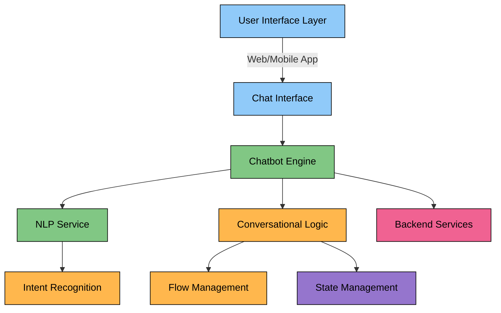

# AWS Lex Chatbot for Customer Interaction

This project is an AI-powered chatbot built using **AWS Lex** and **AWS Lambda**, designed to enhance customer experience for Tomorrow's AI. It provides quick answers to FAQs, showcases services and case studies, and enables users to schedule consultations directly. The chatbot is configured with **20+ intents**, each offering unique interactions to guide users through different processes.

For simplicity, I've included only a few example conversations rather than the entire flow to keep it easy to follow. You can explore the full chatbot experience on [Tomorrow's AI Website](https://www.tomorrowsai.org).

## Demo

To see the bot in action, watch the video below:

*Go to website `Tomorrow's AI` with the actual video to interact with chatbot and experience full conversation flow.*

---

## Features

- **Dynamic Question Cards**: Each intent provides clickable cards that guide users through their interactions.
- **Multi-Intent Support**: 20+ intents are configured to cover services, FAQs, and consultation scheduling.
- **Real-Time Booking**: Users can schedule consultations, selecting their preferred date, time, and timezone. The chatbot collects details on their business issues to customize the consultation.
- **Google Calendar Integration**: Consultation details are saved to Google Calendar, and a meeting is scheduled using **Google Meet** for phone or video calls.
- **Fallback and Error Handling**: If the bot doesn't understand something, it provides friendly prompts to help users.

## Chatbot Application Architecture

## Chatbot Application Architecture

```mermaid
graph TD;

    C[Chatbot Engine] --> I[Backend Services]
    I --> J[Business Logic Layer]
    I --> K[Data Management]
    J --> L[Microservices Architecture]
    J --> M[API Gateway]
    K --> N[Relational Database]
    K --> O[NoSQL Database]
    K --> P[Data Pipelines]
    
    I --> Q[Integration Layer]
    Q --> R[Calendar Integration]
    Q --> S[CRM Integration]
    Q --> T[AI and ML Services]
    T --> U[Machine Learning Models]
    T --> V[Generative AI Models]
    
    I --> W[Security and Compliance]
    W --> X[Authentication and Authorization]
    W --> Y[Data Security]
    X --> Z[OAuth 2.0 / OpenID Connect]
    X --> AA[RBAC]
    Y --> AB[Encryption]
    Y --> AC[Compliance]
    
    I --> AD[Deployment and Infrastructure]
    AD --> AE[Cloud Provider]
    AD --> AF[Containerization]
    AE --> AG[AWS / Azure / Google Cloud]
    AF --> AH[Docker and Kubernetes]
    
    I --> AI[CI/CD Pipeline]
    AI --> AJ[Continuous Integration/Continuous Deployment]
    
    I --> AK[Monitoring and Analytics]
    AK --> AL[Logging and Monitoring]
    AK --> AM[User Analytics]
    AL --> AN[ELK Stack, Prometheus, Grafana]
    AM --> AO[Google Analytics, Mixpanel]
    
    I --> AP[Feedback and Iteration]
    AP --> AQ[User Feedback Loop]
    AQ --> AR[Feedback Collection]
    AQ --> AS[Iterative Improvement]

    
    %% Styling for nodes
    style A fill:#90CAF9,stroke:#000000,stroke-width:1px,color:black,font-size:16px;
    style B fill:#90CAF9,stroke:#000000,stroke-width:1px,color:black,font-size:16px;
    style C fill:#81C784,stroke:#000000,stroke-width:1px,color:black,font-size:16px;
    style D fill:#81C784,stroke:#000000,stroke-width:1px,color:black,font-size:16px;
    style E fill:#FFB74D,stroke:#000000,stroke-width:1px,color:black,font-size:16px;
    style F fill:#FFB74D,stroke:#000000,stroke-width:1px,color:black,font-size:16px;
    style G fill:#FFB74D,stroke:#000000,stroke-width:1px,color:black,font-size:16px;
    style H fill:#9575CD,stroke:#000000,stroke-width:1px,color:black,font-size:16px;
    style I fill:#F06292,stroke:#000000,stroke-width:1px,color:black,font-size:16px;
    style J fill:#A1887F,stroke:#000000,stroke-width:1px,color:black,font-size:16px;
    style K fill:#A1887F,stroke:#000000,stroke-width:1px,color:black,font-size:16px;
    style L fill:#A1887F,stroke:#000000,stroke-width:1px,color:black,font-size:16px;
    style M fill:#A1887F,stroke:#000000,stroke-width:1px,color:black,font-size:16px;
    style N fill:#EF5350,stroke:#000000,stroke-width:1px,color:black,font-size:16px;
    style O fill:#EF5350,stroke:#000000,stroke-width:1px,color:black,font-size:16px;
    style P fill:#EF5350,stroke:#000000,stroke-width:1px,color:black,font-size:16px;
    style Q fill:#7986CB,stroke:#000000,stroke-width:1px,color:black,font-size:16px;
    style R fill:#7986CB,stroke:#000000,stroke-width:1px,color:black,font-size:16px;
    style S fill:#7986CB,stroke:#000000,stroke-width:1px,color:black,font-size:16px;
    style T fill:#FFEB3B,stroke:#000000,stroke-width:1px,color:black,font-size:16px;
    style U fill:#FFEB3B,stroke:#000000,stroke-width:1px,color:black,font-size:16px;
    style V fill:#FFEB3B,stroke:#000000,stroke-width:1px,color:black,font-size:16px;
    style W fill:#FF7043,stroke:#000000,stroke-width:1px,color:black,font-size:16px;
    style X fill:#FF7043,stroke:#000000,stroke-width:1px,color:black,font-size:16px;
    style Y fill:#FF7043,stroke:#000000,stroke-width:1px,color:black,font-size:16px;
    style Z fill:#FF7043,stroke:#000000,stroke-width:1px,color:black,font-size:16px;
    style AA fill:#FF7043,stroke:#000000,stroke-width:1px,color:black,font-size:16px;
    style AB fill:#FF7043,stroke:#000000,stroke-width:1px,color:black,font-size:16px;
    style AC fill:#FF7043,stroke:#000000,stroke-width:1px,color:black,font-size:16px;
    style AD fill:#673AB7,stroke:#000000,stroke-width:1px,color:black,font-size:16px;
    style AE fill:#673AB7,stroke:#000000,stroke-width:1px,color:black,font-size:16px;
    style AF fill:#673AB7,stroke:#000000,stroke-width:1px,color:black,font-size:16px;
    style AG fill:#673AB7,stroke:#000000,stroke-width:1px,color:black,font-size:16px;
    style AH fill:#673AB7,stroke:#000000,stroke-width:1px,color:black,font-size:16px;
    style AI fill:#FF5722,stroke:#000000,stroke-width:1px,color:black,font-size:16px;
    style AJ fill:#FF5722,stroke:#000000,stroke-width:1px,color:black,font-size:16px;
    style AK fill:#2196F3,stroke:#000000,stroke-width:1px,color:black,font-size:16px;
    style AL fill:#2196F3,stroke:#000000,stroke-width:1px,color:black,font-size:16px;
    style AM fill:#2196F3,stroke:#000000,stroke-width:1px,color:black,font-size:16px;
    style AN fill:#2196F3,stroke:#000000,stroke-width:1px,color:black,font-size:16px;
    style AO fill:#2196F3,stroke:#000000,stroke-width:1px,color:black,font-size:16px;
    style AP fill:#4CAF50,stroke:#000000,stroke-width:1px,color:black,font-size:16px;
    style AQ fill:#4CAF50,stroke:#000000,stroke-width:1px,color:black,font-size:16px;
    style AR fill:#4CAF50,stroke:#000000,stroke-width:1px,color:black,font-size:16px;
    style AS fill:#4CAF50,stroke:#000000,stroke-width:1px,color:black,font-size:16px;
 
```

## Installation & Setup

1. **Log in to your AWS Management Console**.
2. **Navigate to AWS Lex**:
   - Create a new chatbot by selecting "Create bot".
   - Configure the bot settings (language, output voice, etc.).
3. **Create Intents**:
   - Create intents with corresponding **utterances** (e.g., "What services do you offer?") and **responses** (dynamic messages or cards).
   - Set up fallback intents to handle unrecognized inputs.
4. **Configure Slots**:
   - Add slots to collect user data such as **name**, **preferred date/time**, **timezone**, and **business problems**.
5. **Enable Multi-Turn Conversations**:
   - Configure the bot to handle multiple turns of conversation, like confirming appointment details.
6. **Lambda Integration for Booking**:
   - Use **AWS Lambda** to process booking details and integrate with **Google Calendar** to schedule consultations and set up **Google Meet** for video or phone calls.
7. **Deploy the Bot**:
   - Test the bot using AWS Lex's built-in testing console.
   - Deploy the bot and integrate it into your platform (website, mobile app, etc.) via API Gateway or AWS SDK.
  
---

## Screenshots

Here are some screenshots showing the different steps and flows of the chatbot:

### 1. Bot Configuration
| Create Bot | Set Up | Language |
|:---:|:---:|:---:|
|  |  |  |

*Caption describing what this demo shows.*

### 2. User Interaction Example
| Intent | Utterances | Response | Cards | Test |
|:---:|:---:|:---:|
|:---:|:---:|
|  |  |  |  | |

*Caption describing what this demo shows.*

### 3. Booking Process
| Slots | Google API | Lambda |
|:---:|:---:|:---:|
|  |  |  |

*Caption describing what this demo shows.*

---

## Development Process

### 1. Intent Design
Each intent includes:
- **Utterances**: User inputs that trigger the intent (e.g., "Tell me about your services").
- **Response**: A dynamic message that may include clickable options or follow-up questions.

#### Example: View Services Intent
- **Utterances**:
  - "What services do you offer?"
  - "Tell me about your services."
- **Response**:
  - "Here are our top services:"  
    - Marketing & Business Development  
    - Data & AI Solutions  
    - Custom Software & Generative AI  
    - Consulting, Strategy & Development  
    (with clickable options as cards)

#### Example Conversation Flow
- **User**: "Hello"  
- **Bot**: "Hello! Welcome to Tomorrow's AI. How can I assist you today?"  
  - Options:
    - Learn about our services
    - Explore case studies & success
    - Book a consultation

- **User**: "Learn about our services"  
- **Bot**: "Here are our services:"  
  - Marketing & Business Development  
  - Data & AI Solutions  
  - Custom Software & Generative AI  
  - Consulting, Strategy & Development

- **User**: "Tell me more about Marketing & Business Development"  
- **Bot**: "Marketing & Business Development Services"  
  - Options:
    - Show me success stories
    - Tell me about your software solutions

- **User**: "Tell me more about success stories"  
- **Bot**: "Here are some success stories..."  
  - Options:
    - Yes, get me started!
    - Tell me more about your packages and pricing

#### Booking Intent
- **Utterances**:
  - "I want to book a consultation."
  - "Book a meeting."
- **Response**:
  - "Great! I can help you schedule your consultation. Please provide the following details:"  
    - Name  
    - Preferred date and time  
    - Timezone  
    - A brief description of the problem you want to fix in your business.

#### Lambda Integration for Bookings
- Once the user provides their booking details, **AWS Lambda** processes the information and:
  - Creates a new event in **Google Calendar**.
  - Schedules a **Google Meet** meeting for a phone or video call.
  - Sends confirmation details to the user.

## Testing & Debugging
- **Test with Lex Console**: Ensure intents trigger correctly by using the built-in test window.
- **Monitor with CloudWatch Logs**: Capture logs for debugging errors and monitoring chatbot interactions.
  
## Challenges and Learnings

- **Challenge 1**: Handling multi-turn conversations without confusion.
- **Solution**: Using **session attributes** to store context between turns.
- **Challenge 2**: Integrating external services like Google Calendar and Google Meet.
- **Solution**: Leveraging **AWS Lambda** to interact with Google APIs for calendar and meeting management.

## Conclusion

This AWS Lex chatbot enhances user engagement by offering instant answers, real-time consultation booking, and seamless integration with **Google Calendar** and **Google Meet** for a smooth scheduling experience. Feedback and suggestions are welcome—please open an issue or contact me directly! 

# Connect with Me

)
)
)
)

